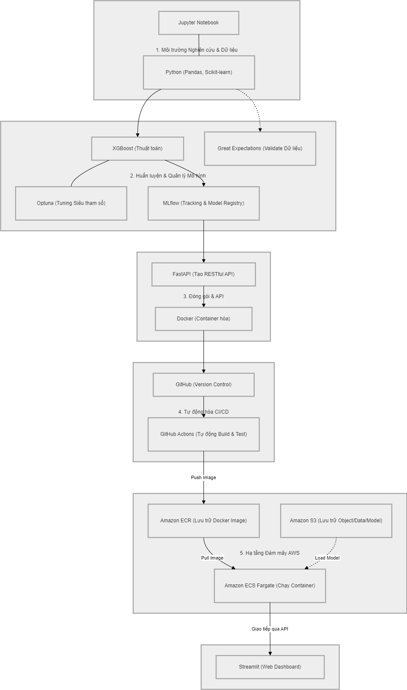

*Read this in other languages: [Tiếng Việt](README-vi.md)*
# Development and Deployment of a Housing Price Prediction System using MLOps

## 👥 Team Members

| Name | Student ID |
|------|------------|
| Lê Chánh Ân | 23520007 |
| Phan Đình Khải | 23520678 |

---

## Introduction

This project builds an end-to-end Machine Learning system for predicting house prices using **XGBoost**. The entire workflow — from data processing and model training to deployment — is automated following modern MLOps practices, including CI/CD, Continuous Training, and GitOps on AWS.

The system provides a **REST API** (FastAPI) for real-time and batch predictions, along with a **Streamlit dashboard** for interactive exploration.

---

## 🛠 Tech Stack

- **Machine Learning:** XGBoost, Scikit-learn, Optuna, MLflow, Pandas, NumPy
- **Backend & UI:** FastAPI, Streamlit, Uvicorn
- **Infrastructure (AWS):** S3, ECR, EKS (Kubernetes), VPC Endpoints (PrivateLink)
- **DevOps & MLOps:** Terraform (IaC), Argo CD (GitOps), GitHub Actions, Docker, `uv`
- **Security & Quality:** SonarQube, Trivy

---

## 📐 System Architecture



Data flows through the pipeline in the following order:

```
Load → Preprocess → Feature Engineering → Train → Tune → Evaluate → Inference → Batch → Serve
```

### 1. Core Modules

**`src/feature_pipeline/`**
- `load.py` — Time-based data splitting: train (< 2020), eval (2020–21), holdout (≥ 2022)
- `preprocess.py` — City name normalization, duplicate removal, outlier filtering
- `feature_engineering.py` — Temporal features, frequency encoding (zipcode), target encoding (city_full)

**`src/training_pipeline/`**
- `train.py` — XGBoost baseline training
- `tune.py` — Hyperparameter optimization with Optuna, experiment logging with MLflow
- `eval.py` — Model evaluation and metrics computation

**`src/inference_pipeline/`**
- `inference.py` — Runs predictions by reloading the encoders and transforms saved during training

**`src/batch/`**
- `run_monthly.py` — Scheduled batch predictions on the holdout dataset

**`src/api/`**
- `main.py` — FastAPI with prediction endpoints, batch processing, and S3 integration

### 2. Web App (`app.py`)

Streamlit dashboard that calls the API for real-time predictions. Supports filtering by year, month, and region, and displays charts comparing predicted vs. actual prices.

### 3. Cloud Infrastructure & GitOps

Application source code and deployment configuration are split into two separate repositories following GitOps principles:

👉 **GitOps Repository:** [Development-and-Deployment-of-a-Housing-Price-Prediction-System-using-MLOps-GitOps](https://github.com/khaipd18/Development-and-Deployment-of-a-Housing-Price-Prediction-System-using-MLOps-GitOps.git)

| Component | Role |
|-----------|------|
| **AWS S3** | Stores raw data, processed data, models, and encoders (`housing-regression-data-mlops`) |
| **Amazon ECR** | Stores Docker images for the API and UI |
| **Amazon EKS** | Kubernetes cluster running the backend and frontend containers |
| **VPC Endpoints** | Allows EKS to communicate with S3, ECR, EC2, and CloudWatch over a private network, without going through the public Internet |
| **Terraform** | Manages all infrastructure as code (VPC, EKS, ECR, VPC Endpoints, IAM OIDC) |
| **Argo CD** | Watches the GitOps repo for changes and automatically syncs state to EKS |
| **GitHub Actions** | Runs CI/CD and Continuous Training pipelines |

---

## 📊 Model Performance

XGBoost model after hyperparameter tuning with Optuna, evaluated on the Holdout set (data ≥ 2022):

| Metric | Value |
|--------|-------|
| **MAE** | 32,900.98 |
| **RMSE** | 74,151.63 |
| **R² Score** | 0.9575 |

Detailed results from each run can be viewed in the MLflow UI (`http://localhost:5000`).

---

## Key Design Decisions

**Time-based Splitting** — Instead of random splitting, data is divided chronologically: train (< 2020), eval (2020–21), holdout (≥ 2022). This mirrors the real-world scenario of using past data to predict the future, making evaluation results more reliable than a random split.

**Encoder Persistence** — Frequency and target encoders are fit only on the training set, then saved as `.pkl` files to S3. At inference time, the system reloads exactly these files. This prevents data leakage and ensures the serving input structure matches what the model was trained on.

**Automated Continuous Training** — The CT workflow runs on a schedule (cron job on the 1st of each month), automatically pulling fresh data from S3, re-running the full pipeline, and pushing the latest model back to S3 — no manual intervention needed.

**DevSecOps** — The CI/CD pipeline integrates SonarQube for static code analysis and Trivy for CVE scanning of Docker images before they are pushed to ECR. Security is checked inside the pipeline, not after deployment.

**VPC Endpoints** — EKS worker nodes live in private subnets and connect to S3 and ECR via VPC Endpoints, with no NAT Gateway and no traffic going over the public Internet. This reduces both cost and attack surface.

**GitOps** — All deployment state is declared in Git. Argo CD is the only thing allowed to apply changes to the cluster — no one touches EKS directly.

---

## Data Setup

Before running any pipeline, download the raw dataset first:

1. Go to Kaggle: [HouseTS Dataset](https://www.kaggle.com/datasets/shengkunwang/housets-dataset)
2. Download the file
3. Rename it to `untouched_raw_original.csv`
4. Place it at: `data/raw/untouched_raw_original.csv`

---

## Running Locally

### Environment Setup

```bash
uv venv
source .venv/bin/activate  # Windows: .venv\Scripts\activate
uv pip install -r requirements.txt
```

### Running the Pipelines

```bash
# 1. Data pipeline
python src/feature_pipeline/load.py
python -m src.feature_pipeline.preprocess
python -m src.feature_pipeline.feature_engineering

# 2. Training & evaluation
python src/training_pipeline/train.py
python src/training_pipeline/tune.py
python src/training_pipeline/eval.py

# 3. Start services
uv run uvicorn src.api.main:app --host 0.0.0.0 --port 8000       # API
streamlit run app.py --server.port 8501 --server.address 0.0.0.0  # UI
```

### MLflow UI

```bash
mlflow ui
```

Visit `http://localhost:5000` to browse run history and Optuna tuning charts.

---

## 🔌 API Documentation

Once the API is running, visit `http://localhost:8000/docs` for the interactive Swagger UI.

Example prediction request:

```bash
curl -X POST 'http://localhost:8000/predict' \
  -H 'Content-Type: application/json' \
  -d '{
    "zipcode": 98101,
    "bedrooms": 3,
    "bathrooms": 2.0,
    "sqft_living": 1500
  }'
```

---

## Cloud Automation

### Step 1 — Provision Infrastructure (Terraform)

Can be triggered automatically via GitHub Actions (`infra.yml`), or run manually:

```bash
cd terraform
terraform init
terraform plan
terraform apply -auto-approve
```

### Step 2 — Upload Raw Data to S3

```bash
aws s3 cp data/raw/untouched_raw_original.csv s3://housing-regression-data-mlops/raw/untouched_raw_original.csv
```

### Step 3 — Continuous Training (CT)

Workflow `ct.yaml` — trigger manually via `workflow_dispatch` or runs automatically on the 1st of each month.

The pipeline will:
1. Pull data from S3
2. Run the full data pipeline
3. Train, tune (Optuna), and evaluate — logging everything with MLflow
4. Push the updated model, encoders, and processed data back to S3

### Step 4 — CI/CD

Workflow `ci.yml` — triggers automatically on every push or merge to `main`.

The pipeline will:
1. Run static code analysis (SonarQube) and unit tests (Pytest)
2. Build 2 Docker images: `housing-api` and `housing-ui`
3. Scan for security vulnerabilities with Trivy
4. Push images to Amazon ECR
5. Use `yq` to automatically update the image tag (`github.sha`) in `values-dev.yaml` in the GitOps repo

### Step 5 — GitOps (Argo CD)

Once CI/CD commits the new tag to the GitOps repo, Argo CD detects the change and automatically deploys the new version to EKS via a Rolling Update — zero downtime.

> For Argo CD installation and setup on EKS, see the [GitOps Repository](https://github.com/khaipd18/Development-and-Deployment-of-a-Housing-Price-Prediction-System-using-MLOps-GitOps.git).

---

## 📁 Project Structure

```
├── .github/workflows/
│   ├── ci.yml                 # CI/CD: test, build, push to ECR, update GitOps repo
│   ├── ct.yaml                # Continuous Training: scheduled monthly retraining
│   └── infra.yml              # Terraform: plan and apply infrastructure changes
├── configs/                   # System and model configuration files
├── data/
│   ├── raw/                   # Raw data (untouched_raw_original.csv)
│   ├── processed/             # Data after feature engineering
│   └── predictions/           # Batch prediction outputs
├── models/                    # Trained model (.pkl) and encoder files
├── notebooks/                 # Jupyter Notebooks for EDA and experimentation
├── src/
│   ├── api/                   # FastAPI backend
│   ├── batch/                 # Monthly batch prediction script
│   ├── feature_pipeline/      # Load, preprocess, feature engineering
│   ├── training_pipeline/     # Train, tune, evaluate
│   └── inference_pipeline/    # Production inference
├── terraform/
│   ├── modules/
│   │   ├── vpc-endpoints/     # AWS PrivateLink configuration
│   │   ├── eks/               # EKS cluster and worker nodes
│   │   ├── ecr/               # Docker image registry
│   │   └── github-oidc-role/  # IAM role for GitHub Actions
│   ├── main.tf
│   └── backend.tf             # Remote Terraform state (S3)
├── tests/                     # Unit tests and dummy data
├── app.py                     # Streamlit UI
├── Dockerfile                 # Image for FastAPI
├── Dockerfile.streamlit       # Image for Streamlit
├── pyproject.toml / uv.lock
└── requirements.txt
```
---

## 🧹 Teardown

> **Read this before running `terraform destroy`**

When shutting down the system to save costs, **you must remove all Kubernetes application resources (especially Ingresses) before running `terraform destroy` in the infrastructure repo.**

**Why?**

> The ALBs in this project are created automatically by the **AWS Load Balancer Controller** inside EKS — not by Terraform. If you run `terraform destroy` right away, Terraform will fail to delete the VPC because these ALBs are still holding Network Interfaces (ENIs) inside the Subnet.
>
> **Important:** Do not use `kubectl delete ingress` manually — Argo CD has `selfHeal` enabled and will immediately recreate the ALB as soon as you delete it. The only clean way is to delete the Argo CD Applications entirely.

**Correct teardown order (Cascade Delete):**

**1. Remove all applications via Argo CD (App of Apps):**

Thanks to the `finalizers` configured in the root app, deleting it will cause Argo CD to automatically clean up all child resources — including Ingresses and ALBs:

```bash
kubectl delete -k argocd/root/
```

**2. Wait for the ALBs to be fully removed:**

Go to AWS Console → EC2 → Load Balancers and wait 2–3 minutes until the Dev and Prod ALBs disappear.

**3. Run terraform destroy:**

```bash
terraform destroy
```